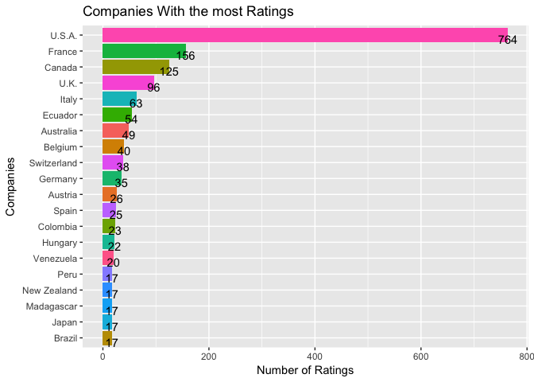

Chocolate-Bar-Ratings
================
2018-01-26

This is a dataset of 1,700 individual chocolate bars. This dataset has information on their regional origin, percentage of cocoa, the variety of chocolate bean used and where the beans were grown. I think it would be fun to use some R code to take a look at what chocolate bar gets the highest rating over the years, what countries has the highest rated bars and what goes into getting a highly rated chocolate bar.

A look at the data:

``` r
kable(head(cocoa), format = "html")
```

<table>
<thead>
<tr>
<th style="text-align:left;">
Company...Maker.if.known.
</th>
<th style="text-align:left;">
Specific.Bean.Origin.or.Bar.Name
</th>
<th style="text-align:right;">
REF
</th>
<th style="text-align:right;">
Review.Date
</th>
<th style="text-align:left;">
Cocoa.Percent
</th>
<th style="text-align:left;">
Company.Location
</th>
<th style="text-align:right;">
Rating
</th>
<th style="text-align:left;">
Bean.Type
</th>
<th style="text-align:left;">
Broad.Bean.Origin
</th>
</tr>
</thead>
<tbody>
<tr>
<td style="text-align:left;">
A. Morin
</td>
<td style="text-align:left;">
Agua Grande
</td>
<td style="text-align:right;">
1876
</td>
<td style="text-align:right;">
2016
</td>
<td style="text-align:left;">
63%
</td>
<td style="text-align:left;">
France
</td>
<td style="text-align:right;">
3.75
</td>
<td style="text-align:left;">
</td>
<td style="text-align:left;">
Sao Tome
</td>
</tr>
<tr>
<td style="text-align:left;">
A. Morin
</td>
<td style="text-align:left;">
Kpime
</td>
<td style="text-align:right;">
1676
</td>
<td style="text-align:right;">
2015
</td>
<td style="text-align:left;">
70%
</td>
<td style="text-align:left;">
France
</td>
<td style="text-align:right;">
2.75
</td>
<td style="text-align:left;">
</td>
<td style="text-align:left;">
Togo
</td>
</tr>
<tr>
<td style="text-align:left;">
A. Morin
</td>
<td style="text-align:left;">
Atsane
</td>
<td style="text-align:right;">
1676
</td>
<td style="text-align:right;">
2015
</td>
<td style="text-align:left;">
70%
</td>
<td style="text-align:left;">
France
</td>
<td style="text-align:right;">
3.00
</td>
<td style="text-align:left;">
</td>
<td style="text-align:left;">
Togo
</td>
</tr>
<tr>
<td style="text-align:left;">
A. Morin
</td>
<td style="text-align:left;">
Akata
</td>
<td style="text-align:right;">
1680
</td>
<td style="text-align:right;">
2015
</td>
<td style="text-align:left;">
70%
</td>
<td style="text-align:left;">
France
</td>
<td style="text-align:right;">
3.50
</td>
<td style="text-align:left;">
</td>
<td style="text-align:left;">
Togo
</td>
</tr>
<tr>
<td style="text-align:left;">
A. Morin
</td>
<td style="text-align:left;">
Quilla
</td>
<td style="text-align:right;">
1704
</td>
<td style="text-align:right;">
2015
</td>
<td style="text-align:left;">
70%
</td>
<td style="text-align:left;">
France
</td>
<td style="text-align:right;">
3.50
</td>
<td style="text-align:left;">
</td>
<td style="text-align:left;">
Peru
</td>
</tr>
<tr>
<td style="text-align:left;">
A. Morin
</td>
<td style="text-align:left;">
Carenero
</td>
<td style="text-align:right;">
1315
</td>
<td style="text-align:right;">
2014
</td>
<td style="text-align:left;">
70%
</td>
<td style="text-align:left;">
France
</td>
<td style="text-align:right;">
2.75
</td>
<td style="text-align:left;">
Criollo
</td>
<td style="text-align:left;">
Venezuela
</td>
</tr>
</tbody>
</table>
I need to remove the % sign in Cocoa.Percent and make it an int. I also want to rename some of the columns to shorter names.

``` r
cocoa$Cocoa.Percent<-gsub("%","",cocoa$Cocoa.Percent)

cocoa$Cocoa.Percent <- as.integer(cocoa$Cocoa.Percent)

cocoa <- cocoa %>% rename(company = Company...Maker.if.known., 
                          bean_origin_city= Specific.Bean.Origin.or.Bar.Name, 
                          bean_origin_country = Broad.Bean.Origin, 
                          company_location = Company.Location, 
                          review_date = Review.Date, 
                          cocoa_percent = Cocoa.Percent, 
                          bean_type = Bean.Type)

str(cocoa)
```

    ## 'data.frame':    1795 obs. of  9 variables:
    ##  $ company            : Factor w/ 416 levels "A. Morin","Acalli",..: 1 1 1 1 1 1 1 1 1 1 ...
    ##  $ bean_origin_city   : Factor w/ 1039 levels "\"heirloom\", Arriba Nacional",..: 15 494 68 16 813 175 288 923 805 731 ...
    ##  $ REF                : int  1876 1676 1676 1680 1704 1315 1315 1315 1319 1319 ...
    ##  $ review_date        : int  2016 2015 2015 2015 2015 2014 2014 2014 2014 2014 ...
    ##  $ cocoa_percent      : int  63 70 70 70 70 70 70 70 70 70 ...
    ##  $ company_location   : Factor w/ 60 levels "Amsterdam","Argentina",..: 19 19 19 19 19 19 19 19 19 19 ...
    ##  $ Rating             : num  3.75 2.75 3 3.5 3.5 2.75 3.5 3.5 3.75 4 ...
    ##  $ bean_type          : Factor w/ 41 levels " ","Amazon","Amazon mix",..: 1 1 1 1 1 9 1 9 9 1 ...
    ##  $ bean_origin_country: Factor w/ 100 levels " ","Africa, Carribean, C. Am.",..: 69 79 79 79 56 92 17 92 92 56 ...

Ok now lets see a distribution of the Ratings.

``` r
ggplot(cocoa, aes(x = Rating)) +
      geom_histogram(color = "black", fill = "red", binwidth = .25) +
      scale_y_continuous(breaks = seq(0,400,25)) +
      labs(x = "Ratings", title = "Cocoa Ratings", y = "Count")
```


Not bad most in the 2.5 to 4 range. The mean is 3.186 and the median is 3.25

How about the distribution of the amount of cocoa in each chocolate bar.

``` r
ggplot(cocoa, aes(x = cocoa_percent)) +
      geom_histogram(color = "black", fill = "red", binwidth = 3) +
      scale_y_continuous(breaks = seq(0,800,50)) +
      labs(x = "Percent Cocoa", title = "The Percent of Cocoa in Each Bar", y = "Count")
```

 Ok so most companies use around 67-71 percent cocoa in there chocolate bars. The mean is 71.7 and the median is 70

There are 416 unique companies in this dataset, lets look at the the 20 companies with the most ratings. Below is a graph of the 20 companies that have the most chocolate ratings.

``` r
n2 <- cocoa %>% group_by(company) %>% 
                summarise(count = n()) %>% 
                arrange(desc(count)) %>%
                top_n(20, wt = count)

ggplot(n2, aes(x = reorder(company, count),
               y = count, fill = company)) + 
                      geom_bar(stat = "identity")  +
                      geom_text(aes(label = count), vjust = 1, hjust = .5) + 
                      labs(x = "Companies", y = "Number of Ratings", title = "Companies With the most Ratings") +
                      theme(legend.position = "none") +
                      coord_flip()
```


A look at where 20 most represented company location countries.

``` r
n3 <- cocoa %>% group_by(company_location) %>% 
                summarise(count = n()) %>% 
                arrange(desc(count)) %>%
                top_n(20, wt = count)   

ggplot(n3, aes(x = reorder(company_location, count),
               y = count, fill = company_location)) + 
                      geom_bar(stat = "identity")  +
                      geom_text(aes(label = count), vjust = 1, hjust = .5) + 
                      labs(x = "Companies", y = "Number of Ratings", title = "Companies With the most Ratings") +
                      theme(legend.position = "none") +
                      coord_flip()
```



That is interesting the United States is while represnted in this dataset. I thought Switzerland, Germany and Belgium would have more chocolate bars rated.
