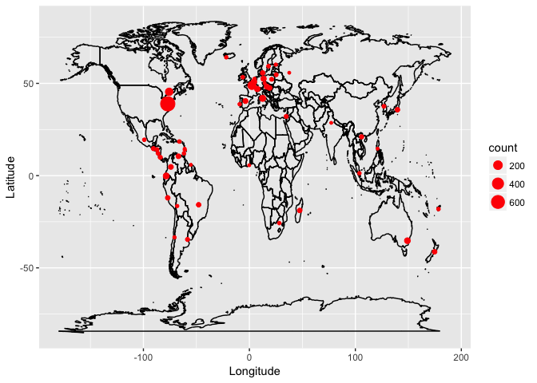

Chocolate-Bar-Ratings
================
2018-01-29

This is a dataset of 1,700 individual chocolate bars. This dataset has information on their regional origin, percentage of cocoa, the variety of chocolate bean used and where the beans were grown. I think it would be fun to use some R code to take a look at what chocolate bar gets the highest rating over the years, what countries has the highest rated bars and what goes into getting a highly rated chocolate bar.

A look at the data:

``` r
kable(head(cocoa), format = "html")
```

<table>
<thead>
<tr>
<th style="text-align:left;">
Company...Maker.if.known.
</th>
<th style="text-align:left;">
Specific.Bean.Origin.or.Bar.Name
</th>
<th style="text-align:right;">
REF
</th>
<th style="text-align:right;">
Review.Date
</th>
<th style="text-align:left;">
Cocoa.Percent
</th>
<th style="text-align:left;">
Company.Location
</th>
<th style="text-align:right;">
Rating
</th>
<th style="text-align:left;">
Bean.Type
</th>
<th style="text-align:left;">
Broad.Bean.Origin
</th>
</tr>
</thead>
<tbody>
<tr>
<td style="text-align:left;">
A. Morin
</td>
<td style="text-align:left;">
Agua Grande
</td>
<td style="text-align:right;">
1876
</td>
<td style="text-align:right;">
2016
</td>
<td style="text-align:left;">
63%
</td>
<td style="text-align:left;">
France
</td>
<td style="text-align:right;">
3.75
</td>
<td style="text-align:left;">
NA
</td>
<td style="text-align:left;">
Sao Tome
</td>
</tr>
<tr>
<td style="text-align:left;">
A. Morin
</td>
<td style="text-align:left;">
Kpime
</td>
<td style="text-align:right;">
1676
</td>
<td style="text-align:right;">
2015
</td>
<td style="text-align:left;">
70%
</td>
<td style="text-align:left;">
France
</td>
<td style="text-align:right;">
2.75
</td>
<td style="text-align:left;">
NA
</td>
<td style="text-align:left;">
Togo
</td>
</tr>
<tr>
<td style="text-align:left;">
A. Morin
</td>
<td style="text-align:left;">
Atsane
</td>
<td style="text-align:right;">
1676
</td>
<td style="text-align:right;">
2015
</td>
<td style="text-align:left;">
70%
</td>
<td style="text-align:left;">
France
</td>
<td style="text-align:right;">
3.00
</td>
<td style="text-align:left;">
NA
</td>
<td style="text-align:left;">
Togo
</td>
</tr>
<tr>
<td style="text-align:left;">
A. Morin
</td>
<td style="text-align:left;">
Akata
</td>
<td style="text-align:right;">
1680
</td>
<td style="text-align:right;">
2015
</td>
<td style="text-align:left;">
70%
</td>
<td style="text-align:left;">
France
</td>
<td style="text-align:right;">
3.50
</td>
<td style="text-align:left;">
NA
</td>
<td style="text-align:left;">
Togo
</td>
</tr>
<tr>
<td style="text-align:left;">
A. Morin
</td>
<td style="text-align:left;">
Quilla
</td>
<td style="text-align:right;">
1704
</td>
<td style="text-align:right;">
2015
</td>
<td style="text-align:left;">
70%
</td>
<td style="text-align:left;">
France
</td>
<td style="text-align:right;">
3.50
</td>
<td style="text-align:left;">
NA
</td>
<td style="text-align:left;">
Peru
</td>
</tr>
<tr>
<td style="text-align:left;">
A. Morin
</td>
<td style="text-align:left;">
Carenero
</td>
<td style="text-align:right;">
1315
</td>
<td style="text-align:right;">
2014
</td>
<td style="text-align:left;">
70%
</td>
<td style="text-align:left;">
France
</td>
<td style="text-align:right;">
2.75
</td>
<td style="text-align:left;">
Criollo
</td>
<td style="text-align:left;">
Venezuela
</td>
</tr>
</tbody>
</table>
I need to remove the % sign in Cocoa.Percent and make it an int. I also want to rename some of the columns to shorter names, make some spelling corrections in the bean country origin column.

``` r
cocoa$Cocoa.Percent<-gsub("%","",cocoa$Cocoa.Percent)

cocoa$Cocoa.Percent <- as.integer(cocoa$Cocoa.Percent)

cocoa <- cocoa %>% rename(company = Company...Maker.if.known., 
                          bean_origin_city= Specific.Bean.Origin.or.Bar.Name, 
                          bean_origin_country = Broad.Bean.Origin, 
                          company_location = Company.Location, 
                          review_date = Review.Date, 
                          cocoa_percent = Cocoa.Percent, 
                          bean_type = Bean.Type)
   
#There is a spelling error in Dominican Republic some are spelled Domincan Republic.
cocoa$bean_origin_country[ cocoa$bean_origin_country == "Domincan Republic"] <- "Dominican Republic" 

#If I want to join the Lat and lon data I need the countries to match    
#so I need to change Trinidad to Trinidad and Tobago
cocoa$bean_origin_country[ cocoa$bean_origin_country == "Trinidad"] <- "Trinidad and Tobago" 
cocoa$bean_origin_country[ cocoa$bean_origin_country == "Burma"] <- "Myanmar"
cocoa$company_location<-gsub("U.S.A.","United States",cocoa$company_location)


cocoa$bean_type[cocoa$bean_type == "Forastero (Arriba) ASS"] <- "Forastero (Arriba)"
cocoa$bean_type <- gsub("Trinitario, Criollo", "Criollo, Trinitario", cocoa$bean_type)
```

#### Now lets see a distribution of the Ratings.

``` r
ggplot(cocoa, aes(x = Rating)) +
      geom_histogram(color = "black", fill = "red", binwidth = .25) +
      scale_y_continuous(breaks = seq(0,400,25)) +
      labs(x = "Ratings", title = "Cocoa Ratings", y = "Count")
```


Not bad most in the 2.5 to 4 range. The mean is 3.186 and the median is 3.25

#### How about the distribution of the amount of cocoa in each chocolate bar.

``` r
ggplot(cocoa, aes(x = cocoa_percent)) +
      geom_histogram(color = "black", fill = "red", binwidth = 3) +
      scale_y_continuous(breaks = seq(0,800,50)) +
      labs(x = "Percent Cocoa", title = "The Percent of Cocoa in Each Bar", y = "Count")
```


Most companies use around 67-71 percent cocoa in there chocolate bars. The mean is 71.7 and the median is 70

#### There are 416 unique companies in this dataset, lets look at the the 20 companies with the most ratings. Below is a graph of the 20 companies that have the most chocolate ratings.

``` r
n2 <- cocoa %>% group_by(company) %>% 
                summarise(count = n()) %>% 
                arrange(desc(count)) %>%
                top_n(20, wt = count)

ggplot(n2, aes(x = reorder(company, count),
               y = count, fill = company)) + 
                      geom_bar(stat = "identity")  +
                      geom_text(aes(label = count), vjust = 1, hjust = .5) + 
                      labs(x = "Companies", y = "Number of Ratings", title = "Companies With the most Ratings") +
                      theme(legend.position = "none") +
                      coord_flip()
```


#### There are chocolate companies on this list from 60 different counties. The 20 most represented company location are.

``` r
n3 <- cocoa %>% group_by(company_location) %>% 
                summarise(count = n()) %>% 
                arrange(desc(count)) %>%
                top_n(20, wt = count)   

ggplot(n3, aes(x = reorder(company_location, count),
               y = count, fill = company_location)) + 
                      geom_bar(stat = "identity")  +
                      geom_text(aes(label = count), vjust = 1, hjust = .5) + 
                      labs(x = "Companies", y = "Number of Ratings", title = "Location of Companies") +
                      theme(legend.position = "none") +
                      coord_flip()
```


That is interesting the United States is while represented in this dataset. I thought Switzerland, Germany and Belgium would have more chocolate bars rated. Lets take a quick look at a map of these locations.

``` r
#Import dataset of latitudes and longitudes for world capitals 
lat_lon <- read.csv("country_lat_lon.txt") 

company_map <- left_join(cocoa, lat_lon, by = c("company_location" = "Country")) %>% select(-c(Capital))

n4 <- company_map %>% filter(!is.na(company_location), !is.na(Latitude)) %>%
                      group_by(company_location, Latitude, Longitude) %>% 
                      summarise(count = n()) %>% 
                      arrange(desc(count)) 

# Get world map
world_map <- map_data("world")

# Draw the map and add the data points in myData

ggplot() +
geom_path(data = world_map, aes(x = long, y = lat, group = group)) +
geom_point(data = n4, aes(x = Longitude, y = Latitude, size = count), color = "red") +
labs("Locations of Chocolate Companies", x = "Longitude", y = "Latitude") +
theme(plot.title=element_text(size=20))
```



#### Cocoa beans are grown in 98 different counties in this dataset the top 20 countries represented are.

``` r
n4 <- cocoa %>% filter(!is.na(bean_origin_country)) %>%
                group_by(bean_origin_country) %>% 
                summarise(count = n()) %>% 
                arrange(desc(count)) %>%
                top_n(20, wt = count)   

ggplot(n4, aes(x = reorder(bean_origin_country, count),
               y = count, fill = bean_origin_country)) + 
                      geom_bar(stat = "identity")  +
                      geom_text(aes(label = count), vjust = 1, hjust = .5) + 
                      labs(x = "Companies", y = "Number of Ratings", title = "Where Are The Cocoa Beans Grown") +
                      theme(legend.position = "none") +
                      coord_flip()
```


8 of the top 10 are in South & central America. I have a dataset that I can join to this one that has the Latitudes and longitudes for the capital of each country around the world. This will allow me to map some of this data.

``` r
#Import dataset of latitudes and longitudes for world capitals 
lat_lon <- read.csv("country_lat_lon.txt") 
origin_map <- left_join(cocoa, lat_lon, by = c("bean_origin_country" = "Country")) %>% select(-c(Capital))

n5 <- origin_map %>% filter(!is.na(bean_origin_country), !is.na(Latitude)) %>%
                     group_by(bean_origin_country, Latitude, Longitude) %>% 
                     summarise(count = n()) %>% 
                     arrange(desc(count)) 

# Get world map
world_map <- map_data("world")

# Draw the map and add the data points in myData
ggplot() +
geom_path(data = world_map, aes(x = long, y = lat, group = group)) +
geom_point(data = n5, aes(x = Longitude, y = Latitude, size = count), color = "red") +
labs("Origin of Cocoa Beans", x = "Longitude", y = "Latitude") +
theme(plot.title=element_text(size=20))
```


All cocoa beans are grown in the tropics, most are grown in Central and South America.

#### I want to see the breakdown of how many rating are in the dataset per year.

``` r
n6 <- cocoa %>% group_by(review_date) %>% 
                summarise(count = n()) 

ggplot(n6, aes(x = review_date, y = count)) +
  geom_point() +
  geom_line() +
  scale_y_continuous(breaks = seq(0,300,25)) + 
  scale_x_continuous(breaks = seq(2006,2017,1)) + 
  labs(title = "Number of Ratings Per Year", x = "Rating Year", y = "Number of Ratings")
```


Not bad to have ten years of data, there is not much data from 2017 but I think this is because the data was retreved in 2017 and the rating were not out for the chocolate that year.

#### What about bean type, looks like there are three main bean types in this dataset that are not blends. Below is a graph of the distribution.

``` r
n7 <- cocoa %>% filter(!is.na(bean_type)) %>%
                group_by(bean_type) %>%
                summarise(count = n()) %>%
                arrange(desc(count)) %>%
                top_n(9, wt = count)

ggplot(n7, aes(x = reorder(bean_type, count),
               y = count, fill = bean_type)) + 
                      geom_bar(stat = "identity")  +
                      geom_text(aes(label = count), vjust = 1, hjust = .5) + 
                      labs(x = "Companies", y = "Number of Ratings", title = "Where Are The Cocoa Beans Grown") +
                      theme(legend.position = "none") +
                      coord_flip()
```


Looking at this graph above the three cocoas here represent 47.97 of the bars rated. The others are bars that use a blend of cocoa. With the research below there are some interesting things happening. The Criollo cocoa is the rarest in the world making up only 5% of the worlds profiction in this dataset it is 23.22%. The Forastero is most comman cocoa which could be why only 13.2% of the chocolate bars use this cocoa. The Trinitario is a hybrid of Criollo and Forastero, this cocoa is used in 63.58% of the chocolate bars.

I did some reseach on the 3 types of cocoa bean in this dataset, the Trinitario which is the most populer in 419 chocolate bars, the Criollo cocoa bean which is in 153 chocolate bars and the Forastero cocoa bean which is in 87 bars.

**Criollo** is a rare tree that is native to Central and South America as well as the Caribbean islands and Sri Lanka. Only 5% of the world’s production is Criollo. This makes up 17.77% of the bars in this dataset
Source ("<https://www.barry-callebaut.com/about-us/media/press-kit/history-chocolate/theobroma-cacao-food-gods>")

**Trinitario** is a natural hybrid biological class resulting from cross-pollination. Legend recounts that it first came into existence on the Island of Trinidad, after a hurricane nearly completely destroyed the local Criollo crops in 1727. Assuming all the trees were dead, the plantations were replanted with Forastero, but spontaneous hybrids appeared. The Trinitario cocoa is the main cocoa in 48.66%
Source ("<https://www.barry-callebaut.com/about-us/media/press-kit/history-chocolate/theobroma-cacao-food-gods>")

**Forastero** is the most commonly cocoa grown. It is most likely native to the Amazon basin. Today, Forastero is mainly grown in Africa, Ecuador and Brazil and accounts for 80% of the world’s cocoa supply. What makes it so popular is that it is much hardier and less susceptible to diseases. It has a much higher yield than the Criollo variety. Forastero cocoa has purple-coloured beans and is mainly used to give chocolate its full-bodied flavor. The Trinitario cocoa is the main cocoa in 10.1%
Source ("<https://www.barry-callebaut.com/about-us/media/press-kit/history-chocolate/theobroma-cacao-food-gods>")

**Forastero (Nacional)** is Forastero cocoa that is native to Ecuador, the flavor is very similar to that of other forasteros, with the addition of fruity overtones that other forasteros typically do not have. Source (<http://www.amanochocolate.com/blog/theobroma-cacao-the-tree-of-life-varieties-of-cacao/>)

**Forastero (Arriba)** one of the only Forastero cacao varieties which can be labeled as fino di aroma cacao. Forastero typically is a bean used for industrial bulk chocolate, but Arriba has a much more refined taste allowing chocolate makers to make wonderful bars based on this cacao.
Source (<https://webcache.googleusercontent.com/search?q=cache:xN75k8S4Hd4J:https://beantobar.wordpress.com/category/arriba/+&cd=11&hl=en&ct=clnk&gl=us>)

**Forastero (Parazinho)** cacao is small, round, fairly smooth, and yellow when ripe.
Source (<https://missionchocolate.com/blogs/travel-blog/63223939-fazenda-venturosa-bahia-brazil>)

**Criollo (Porcelana)** cocoa is the world’s most coveted of cocoa varieties due to its refined flavour profile, a perfect balance of acidity/fruit and lower levels of astringency and bitterness. Notes of nuts, caramel and slight spice are evident, with a buttery texture.
Source (<http://www.chocolatetradingco.com/magazine/features/porcelana>)

With a good idea of what i have in this dataset from the graphs and maps above: cocoa ratings, percent of cocoa in each bar, companies with the most ratings, company locations, locations cocoa beans are grown, number of ratings per year and bean type. I would like to see what makes a high rated chocolate bar, I will look at companie locaton, bean origin country, percent cocoa in the bar, bean type and rating year.
