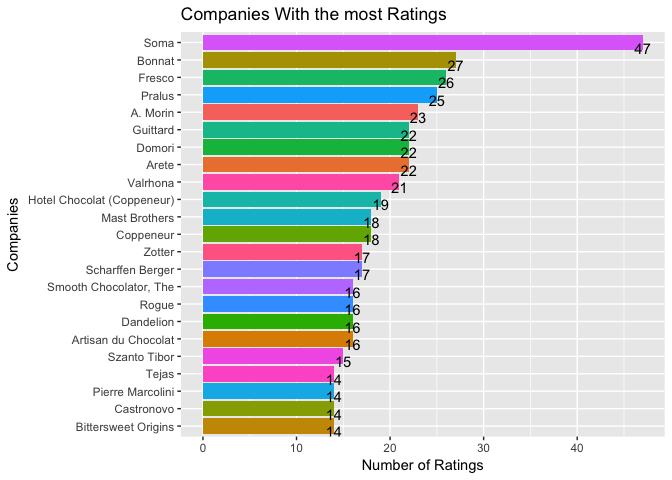
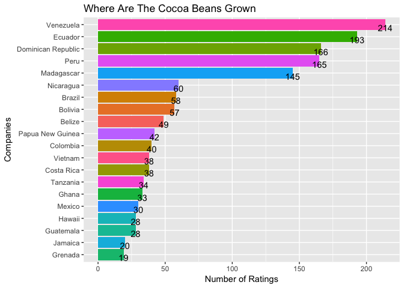

Chocolate-Bar-Ratings
================
2018-01-29

This is a dataset of 1,700 individual chocolate bars. This dataset has information on their regional origin, percentage of cocoa, the variety of chocolate bean used and where the beans were grown. I think it would be fun to use some R code to take a look at what chocolate bar gets the highest rating over the years, what countries has the highest rated bars and what goes into getting a highly rated chocolate bar.

A look at the data:

``` r
kable(head(cocoa), format = "html")
```

<table>
<thead>
<tr>
<th style="text-align:left;">
Company...Maker.if.known.
</th>
<th style="text-align:left;">
Specific.Bean.Origin.or.Bar.Name
</th>
<th style="text-align:right;">
REF
</th>
<th style="text-align:right;">
Review.Date
</th>
<th style="text-align:left;">
Cocoa.Percent
</th>
<th style="text-align:left;">
Company.Location
</th>
<th style="text-align:right;">
Rating
</th>
<th style="text-align:left;">
Bean.Type
</th>
<th style="text-align:left;">
Broad.Bean.Origin
</th>
</tr>
</thead>
<tbody>
<tr>
<td style="text-align:left;">
A. Morin
</td>
<td style="text-align:left;">
Agua Grande
</td>
<td style="text-align:right;">
1876
</td>
<td style="text-align:right;">
2016
</td>
<td style="text-align:left;">
63%
</td>
<td style="text-align:left;">
France
</td>
<td style="text-align:right;">
3.75
</td>
<td style="text-align:left;">
NA
</td>
<td style="text-align:left;">
Sao Tome
</td>
</tr>
<tr>
<td style="text-align:left;">
A. Morin
</td>
<td style="text-align:left;">
Kpime
</td>
<td style="text-align:right;">
1676
</td>
<td style="text-align:right;">
2015
</td>
<td style="text-align:left;">
70%
</td>
<td style="text-align:left;">
France
</td>
<td style="text-align:right;">
2.75
</td>
<td style="text-align:left;">
NA
</td>
<td style="text-align:left;">
Togo
</td>
</tr>
<tr>
<td style="text-align:left;">
A. Morin
</td>
<td style="text-align:left;">
Atsane
</td>
<td style="text-align:right;">
1676
</td>
<td style="text-align:right;">
2015
</td>
<td style="text-align:left;">
70%
</td>
<td style="text-align:left;">
France
</td>
<td style="text-align:right;">
3.00
</td>
<td style="text-align:left;">
NA
</td>
<td style="text-align:left;">
Togo
</td>
</tr>
<tr>
<td style="text-align:left;">
A. Morin
</td>
<td style="text-align:left;">
Akata
</td>
<td style="text-align:right;">
1680
</td>
<td style="text-align:right;">
2015
</td>
<td style="text-align:left;">
70%
</td>
<td style="text-align:left;">
France
</td>
<td style="text-align:right;">
3.50
</td>
<td style="text-align:left;">
NA
</td>
<td style="text-align:left;">
Togo
</td>
</tr>
<tr>
<td style="text-align:left;">
A. Morin
</td>
<td style="text-align:left;">
Quilla
</td>
<td style="text-align:right;">
1704
</td>
<td style="text-align:right;">
2015
</td>
<td style="text-align:left;">
70%
</td>
<td style="text-align:left;">
France
</td>
<td style="text-align:right;">
3.50
</td>
<td style="text-align:left;">
NA
</td>
<td style="text-align:left;">
Peru
</td>
</tr>
<tr>
<td style="text-align:left;">
A. Morin
</td>
<td style="text-align:left;">
Carenero
</td>
<td style="text-align:right;">
1315
</td>
<td style="text-align:right;">
2014
</td>
<td style="text-align:left;">
70%
</td>
<td style="text-align:left;">
France
</td>
<td style="text-align:right;">
2.75
</td>
<td style="text-align:left;">
Criollo
</td>
<td style="text-align:left;">
Venezuela
</td>
</tr>
</tbody>
</table>
I need to remove the % sign in Cocoa.Percent and make it an int. I also want to rename some of the columns to shorter names, make some spelling corrections in the bean country origin column and join a file I have tha has the latitiudes an longituds for the capital of each country.

``` r
cocoa$Cocoa.Percent<-gsub("%","",cocoa$Cocoa.Percent)

cocoa$Cocoa.Percent <- as.integer(cocoa$Cocoa.Percent)

cocoa <- cocoa %>% rename(company = Company...Maker.if.known., 
                          bean_origin_city= Specific.Bean.Origin.or.Bar.Name, 
                          bean_origin_country = Broad.Bean.Origin, 
                          company_location = Company.Location, 
                          review_date = Review.Date, 
                          cocoa_percent = Cocoa.Percent, 
                          bean_type = Bean.Type)
   
#There is a spelling error in Dominican Republic some are spelled Domincan Republic.
cocoa$bean_origin_country[ cocoa$bean_origin_country == "Domincan Republic"] <- "Dominican Republic"   

#If I want to join the Lat and lon data I need the countries to match so I need to change Trinidad to Trinidad and Tobago
cocoa$bean_origin_country[ cocoa$bean_origin_country == "Trinidad"] <- "Trinidad and Tobago" 
cocoa$bean_origin_country[ cocoa$bean_origin_country == "Burma"] <- "Myanmar"

cocoa$company_location<-gsub("U.S.A.","United States",cocoa$company_location)
```

Ok now lets see a distribution of the Ratings.

``` r
ggplot(cocoa, aes(x = Rating)) +
      geom_histogram(color = "black", fill = "red", binwidth = .25) +
      scale_y_continuous(breaks = seq(0,400,25)) +
      labs(x = "Ratings", title = "Cocoa Ratings", y = "Count")
```


Not bad most in the 2.5 to 4 range. The mean is 3.186 and the median is 3.25

How about the distribution of the amount of cocoa in each chocolate bar.

``` r
ggplot(cocoa, aes(x = cocoa_percent)) +
      geom_histogram(color = "black", fill = "red", binwidth = 3) +
      scale_y_continuous(breaks = seq(0,800,50)) +
      labs(x = "Percent Cocoa", title = "The Percent of Cocoa in Each Bar", y = "Count")
```


Most companies use around 67-71 percent cocoa in there chocolate bars. The mean is 71.7 and the median is 70

There are 416 unique companies in this dataset, lets look at the the 20 companies with the most ratings. Below is a graph of the 20 companies that have the most chocolate ratings.

``` r
n2 <- cocoa %>% group_by(company) %>% 
                summarise(count = n()) %>% 
                arrange(desc(count)) %>%
                top_n(20, wt = count)

ggplot(n2, aes(x = reorder(company, count),
               y = count, fill = company)) + 
                      geom_bar(stat = "identity")  +
                      geom_text(aes(label = count), vjust = 1, hjust = .5) + 
                      labs(x = "Companies", y = "Number of Ratings", title = "Companies With the most Ratings") +
                      theme(legend.position = "none") +
                      coord_flip()
```



There are chocolate companies on this list from 60 different counties. The 20 most represented company location are.

``` r
n3 <- cocoa %>% group_by(company_location) %>% 
                summarise(count = n()) %>% 
                arrange(desc(count)) %>%
                top_n(20, wt = count)   

ggplot(n3, aes(x = reorder(company_location, count),
               y = count, fill = company_location)) + 
                      geom_bar(stat = "identity")  +
                      geom_text(aes(label = count), vjust = 1, hjust = .5) + 
                      labs(x = "Companies", y = "Number of Ratings", title = "Companies With the most Ratings") +
                      theme(legend.position = "none") +
                      coord_flip()
```


That is interesting the United States is while represnted in this dataset. I thought Switzerland, Germany and Belgium would have more chocolate bars rated. Lets take a quick look at a map of these locations.

``` r
#Import dataset of latitudes and longitudes for world capitals 
lat_lon <- read.csv("country_lat_lon.txt") 

company_map <- left_join(cocoa, lat_lon, by = c("company_location" = "Country")) %>% select(-c(Capital))

n4 <- company_map %>% filter(!is.na(company_location), !is.na(Latitude)) %>%
                      group_by(company_location, Latitude, Longitude) %>% 
                      summarise(count = n()) %>% 
                      arrange(desc(count)) 

# Get world map
world_map <- map_data("world")

# Draw the map and add the data points in myData

ggplot() +
geom_path(data = world_map, aes(x = long, y = lat, group = group)) +
geom_point(data = n4, aes(x = Longitude, y = Latitude, size = count), color = "red") +
ggtitle("Locations of Chocolate Companies") +
theme(plot.title=element_text(size=20))
```


Cocoa beans are growen in 98 different counties in this dataset the top 20 countries represented are.

``` r
n4 <- cocoa %>% filter(!is.na(bean_origin_country)) %>%
                group_by(bean_origin_country) %>% 
                summarise(count = n()) %>% 
                arrange(desc(count)) %>%
                top_n(20, wt = count)   

ggplot(n4, aes(x = reorder(bean_origin_country, count),
               y = count, fill = bean_origin_country)) + 
                      geom_bar(stat = "identity")  +
                      geom_text(aes(label = count), vjust = 1, hjust = .5) + 
                      labs(x = "Companies", y = "Number of Ratings", title = "Companies With the most Ratings") +
                      theme(legend.position = "none") +
                      coord_flip()
```



8 of the top 10 are in South & central America. I have a dataset that I can join to this one that has the Latitudes and logitudes for the capital of each country around the world. THis will allow me to map some of this data.

``` r
#Import dataset of latitudes and longitudes for world capitals 
lat_lon <- read.csv("country_lat_lon.txt") 

origin_map <- left_join(cocoa, lat_lon, by = c("bean_origin_country" = "Country")) %>% select(-c(Capital))


n5 <- origin_map %>% filter(!is.na(bean_origin_country), !is.na(Latitude)) %>%
                     group_by(bean_origin_country, Latitude, Longitude) %>% 
                     summarise(count = n()) %>% 
                     arrange(desc(count)) 

# Get world map
world_map <- map_data("world")

# Draw the map and add the data points in myData

ggplot() +
geom_path(data = world_map, aes(x = long, y = lat, group = group)) +
geom_point(data = n5, aes(x = Longitude, y = Latitude, size = count), color = "red") +
ggtitle("Origin of Cocoa Beans") +
theme(plot.title=element_text(size=20))
```


